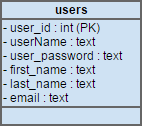
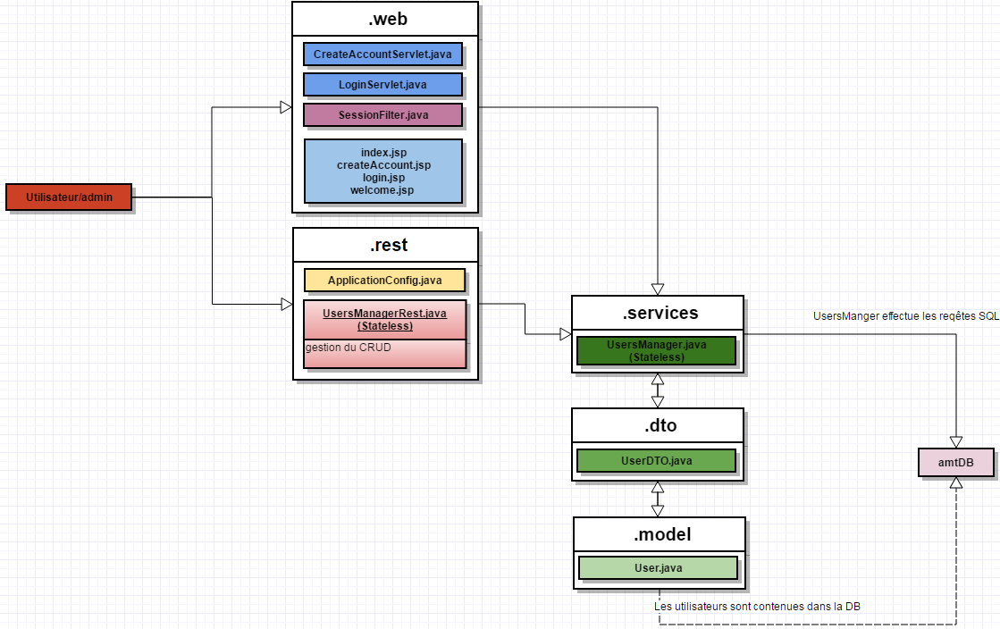

# AMT Discovery 2016

## Description du projet

Le but de ce projet est à déployer une application web java respectant la spécification
Java EE.   
Nous allons devoir déployer un serveur web (Wildfly dans notre cas) sur lequel
nous allons déployer un site web permettant à des utilisateurs de s'enregistrer et de
s'authentifier.  
Ces utilisateurs seront stockés dans une base de données MySQL. Notre site web mettra
également à disposition une api REST permettant d'effectuer les opérations du CRUD.  
Tous ceci sera déployer à l'intérieur de containers docker.

## utilisation

Premièrement il faut avoir docker et docker-compose installé. En suite pour construire les images
il faut aller dans le dossier ``AMT-2016-Discovery`` pui lancé la commande ``docker-compose up --build``. 
Normalement docker devrait télécharger les dépendances et démarrer les images. Pour accèder au site
web il faudra utiliser l'adresse si vous utiliser docker toolbox : ``http://192.168.99.100:9090/AMT-Projet-web/UsersManager``  
ou si votre OS possède docker nativement: ``http://localhost:9090/AMT-Projet-web/UsersManager``

Un compte par défaut est créé pour vous logger sur le site :
username : *admin*  
password : *admin*

Vous pouvez voir la liste des utilisateurs via l'url ``/ServletTest-1.0-SNAPSHOT/UsersManager`` (il faut être loggé pour
pouvoir accèder à cette page).

##Base de données

## fonctionnement de l'architecture

####Remarques sur le fonctionnement
On peut voir que nos servlets, ainsi que notre api REST font appellent au"userManager", celui-ci se charge de gérer les UserDTO qui font le lien
avec les User. Le "userManager" se charge également de faire les requêtes SQL sur la base de données.

## api REST
* **GET** : notre api REST contient 2 *GET*,l'un retourne tous les utilisateurs contenaut dans la base de données, et l'autre retourne les informations
d'un seul utilisateur en fonction de l'ID reçu dans l'URL.
* **POST** : notre api REST contient une méthode *POST* qui permet la création d'un nouvel utilisateur dans la base de données.
* **DELETE** : notre api REST contient une méthode *DELETE* qui permet de supprimer un utilisateur de la base de données en fonctions
de l'ID reçu dans l'URL.
* **PUT** : notre api REST contient une méthode *PUT* qui permet actuellement de modifier tous les champs de l'utilisateur d'un seul coup(sauf l'ID),
nous ne faisont pas de test pour voir quel champs sont défini dans le JSON et lesquels ne sont pas définis.

## Choix et améliorations à faire
* Premièrement au niveau de l'architecture du code nous avons utilisé une seule DTO, cette DTO contient le mot de 
pass de l'utilisateur (ce qui nous permet de le changer facilement avec l'api REST), ce qui n'est pas terrible. Nous avons procéder ainsi pour des raisons de simplicité mais
également parce que notre login se fait encore avec un servlet et n'utilise pas encore l'api REST.

* L'ID de l'utilisateur peut également être modifiée à l'intérieur du code, ce qui est faux, mais nous avons eu besoin
de cette fonctionnalité lors de la création d'un utilisateur, en effet comme l'ID et défénie de manière automatique,
nous ne pouvons pas la définir tous de suite dans l'objet DTO lors de sa création, nous devons dabord aller la chercher dans la base de données
et ensuite l'attribuer au nouvel objet DTO contenant l'utilisateur récément créé.

* Une fois un utilisateur créé il faut clicker sur le bouton login et entrer à nouveau ces informations, ce qui pourraît
être amélioré en logguant l'utilisateur directement à la création du compte.

* La méthode *PUT* du CRUD ne vérifie pas si le nouveau username n'est pas déjà utilisé, on peut donc se retrouver avec 2 personnes avec le même username.

## Test de l'api REST avec postman
Un script postman contenant les différentes requêtes de tests sera fourni dans le dossier "Postman". Il vous suffira
de changer les variables de l'url (pour accèder à l'api REST) et la variable de l'id pour choisir quel utilisateur sélectionner
suivant la requête.

## Problème connues
Nous avons rencontré un petit problème, en effet dans la class "UsersManager.java" nous devons avoir une configuration différentes pour la "dataSource".
Nous devons altérner entre ``java:/jdbc/amtdb`` et ``java:/amtdb`` sans quoi ça ne marche pas sur l'une ou l'autre de nos configuration. La version
avec ``java:/jdbc/amtdb`` semble fonctionner sur le server wildfly démmaré dans docker, donc on c'est cette version qui sera fournie.
